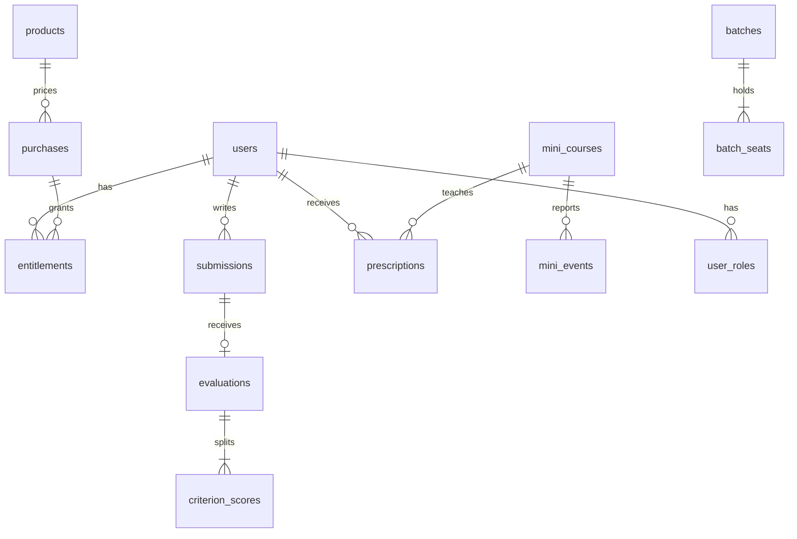

# Platform schema

The diagram matches `supabase/migrations/015_platform_schema.sql`. Mock content remains on the existing `mock_tests` builder tables.

Money is integer cents. Currency defaults to CAD.

Coach reads of `notes.body` and `users.whatsapp_e164` go through `redactStudentRecord` in `src/features/platform/roles.ts`. The database stores the fields. The query layer removes them unless the permission is on.
